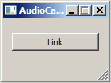

# Overview

The AudioCapture application uses Qt's [QAudioInput](https://doc.qt.io/qt-5/qaudioinput.html) for cross-platform audio capturing. This program has been tested on Windows and MacOS.

# Usage
Using this app is very simple:

  * Make sure that you have connected a microphone to your computer.
  * Start the AudioCapture app. You should see a window like the following. (TODO: New image)
> 
  * Set the audio capture parameters.
    * Make sure the correct audio device is selected.
    * The preferred "Sample Size" should be 16. In our testing, 8- and 32-bits per sample did not produce useful data.
    * The number of output channels can be one or two depending on the connected microphone.
  * Click the "Link" button to link the app to the lab network. If successful, the button should turn into "Unlink".
  * If a firewall complains, allow the app to connect to the network.
  * Please allow microphone access if asked.
  * You should now have a stream on your lab network that has type "Audio" and its name is the name entered in the GUI. Note that you cannot close the app while it is linked.

# Further Notes

The previous version of AudioCaptureWin can be found as a tagged release in this repository.

For Windows XP there is an older LSL audio recording app available on request; it uses the [irrKlang](http://www.ambiera.com/irrklang/) audio library, which in turn uses DirectX audio on Windows. That application does not support support accurate time synchronization and is therefore deprecated.
