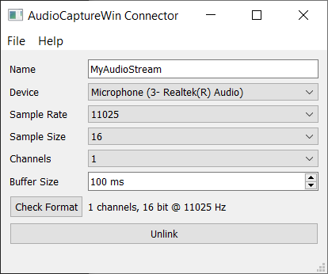

# Overview

The AudioCapture application uses Qt's [QAudioInput](https://doc.qt.io/qt-5/qaudioinput.html) for cross-platform audio capturing. This program has been tested on Windows and MacOS. Download the latest version [from the releases page](https://github.com/labstreaminglayer/App-AudioCapture/releases).

The Windows release requires vc_redist.x64.exe [from Microsoft](https://support.microsoft.com/en-gb/help/2977003/the-latest-supported-visual-c-downloads).

# Usage
Using this app is very simple:

  * Make sure that you have connected a microphone to your computer.
  * On Ubuntu, you need to `sudo apt-get install libqt5multimedia5-plugins`
  * Start the AudioCapture app. You should see a window like the following.
> 
  * Set the audio capture parameters.
    * Make sure the correct audio device is selected.
    * The preferred "Sample Size" should be 16. In our testing, 8- and 32-bits per sample did not produce useful data.
    * The number of output channels can be one or two depending on the connected microphone.
  * Click the "Link" button to link the app to the lab network. If successful, the button should turn into "Unlink".
  * If a firewall complains, allow the app to connect to the network.
  * Please allow microphone access if asked.
  * You should now have a stream on your lab network that has type "Audio" and its name is the name entered in the GUI. Note that you cannot close the app while it is linked.

# Build

The build instructions for this app are mostly the same as the [generic LSL App build instructions](https://labstreaminglayer.readthedocs.io/dev/app_build.html).
Qt Multimedia module is required. On Ubuntu this does not come with qt5 by default. Install it with `sudo apt-get install qtmultimedia5-dev`. On Mac, with homebrew, it is only included in qt6 >= 6.2, which isn't out yet, so qt5 is required.
On Mac, it appears to be necessary to use the Xcode generator: `cmake -B build -S . -DCMAKE_INSTALL_PREFIX="build/install" -G Xcode`

Note that code-signing has been disabled.

# Further Notes

The previous version of AudioCaptureWin can be found as [release v0.1](https://github.com/labstreaminglayer/App-AudioCapture/releases/tag/v0.1) in this repository.

For Windows XP there is an older LSL audio recording app available on request; it uses the [irrKlang](http://www.ambiera.com/irrklang/) audio library, which in turn uses DirectX audio on Windows. That application does not support support accurate time synchronization and is therefore deprecated.
